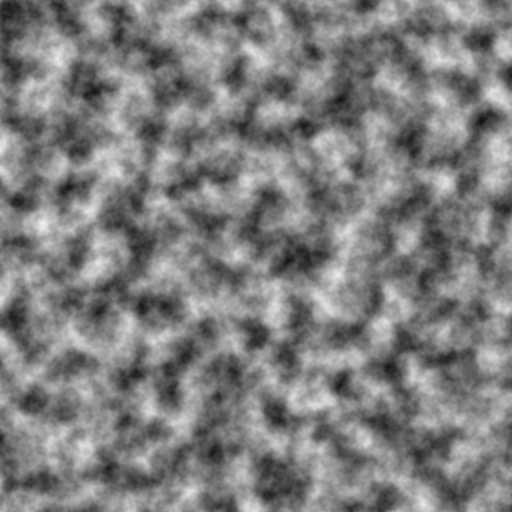

<h1 align="center">` RelNo_D1 `</h1>
<p align="center">
  <b>A modular C++ library for procedural noise maps generation</b><br/>
  Create algorithmically beautiful <b>WhiteNoise</b>, <b>PerlinNoise</b>, and <b>SimplexNoise</b> maps with ease.<br/>
  <i>Lightweight • Dependency-free • Open-source</i>
</p>

<p align="center">
  <i>RelNo_D1 stands for <b>Relative Noise 1D package</b></i><br/>
  There will be 3 Dimensions of RelNo package, every Dimension will have a specific </br> set to focus as so <i><b>RelNo_D1 (1st Dimentsion)</i></b> stands for all the 2D Noise Maps</br>
  later versions will have more maps and functions.</br>
</p>

<p align="center">
  <i><b>Stay Attached for Updated Versions</i></b></br>
</p>

<p align="center">
  <a href="#platform"></a>
  <a href="#language"></a>
  <a href="#build"></a>
  <a href="#library"></a>
  <a href="#license"></a>
</p>

---

<div align="center">
  <br/>
  <strong>✨ Procedural noise generation made simple — one function call away.</strong>
</div>

---

# RelNo_D1

RelNo_D1 — a small, dependency-light C++ library of 2D noise maps:

- **WhiteNoise**
- **PerlinNoise**
- **SimplexNoise**

Designed to be modular, easy to include and extend. The library provides single-call functions (mirroring a Python-style API) and focuses on correctness, clarity and zero runtime dependencies (except a single header for image writing).

---

## Table of contents

- [Install / Build](#install--build)
- [Quick example](#quick-example)
- [API reference](#api-reference)
- [Detailed function reference &amp; calculations](#detailed-function-reference--calculations)
- [Math &amp; Implementation notes](#math--implementation-notes)
- [Project layout](#project-layout)
- [Contributing](#contributing)
- [License](#license)

---

# ⚡ What’s New in RelNo_D1 (Performance Update)

The latest version of **RelNo_D1** introduces a fully optimized backend for procedural noise generation, bringing **SIMD acceleration**, **parallel processing**, and **high‑efficiency memory layouts** to your noise maps.

This update significantly enhances performance for large resolutions, multi‑octave noise, and real‑time use‑cases.

---

## Install / Build

### Prerequisites

- CMake (>= 3.10)
- A C++17-capable compiler (MSVC, clang, gcc)
- (Optional) Visual Studio or other IDE.

### Build

```bash
git clone https://github.com/Adi5423/RelNo_D1/ RelNo_D1
cd RelNo_D1
```

```bash
mkdir build && cd build
```

If want to compile examples built, run:

```bash
cmake ..            
```

```bash
cmake --build . --config Release
```

If building first time, Skip this Step.
if already built once and want to rebuild from scratch, run:

```bash
cmake ..
cmake --build . --clean-first
```

Finally Run.

```bash
RelNoD_NoiseExample.exe #or ./RelNoD_NoiseExample 
```

### Install (optional)

```bash
cmake --install build --prefix install 
# run this from root directory(./RelNo_D1)
```

This will place:

* headers in `/RelNo_D1/install/include/Noise/...`
* libs in `/RelNo_D1/install/lib`

---

## Use in your Project
Via Cmake :
```cmake
find_package(RelNo_D1 REQUIRED)
target_link_libraries(MyApp PRIVATE RelNo_D1::WhiteNoise)
```

---

## ⚙️ Parameters Explained

| Function              | Description                  | Output Range    | Key Parameters                                     |
| --------------------- | ------------------------------ | ------------- | ----------------------------------------------------- |
| `create_whitenoise()`   | Random uniform 2D noise | `[0,1]` | width, height, seed |
| `create_perlinnoise()`  | Smooth gradient-based noise | `[0,1]` | scale, octaves, frequency, persistence, lacunarity, base, seed |
| `create_simplexnoise()` | Faster, artifact-free version of Perlin| `[-1,1]` | scale, octaves, persistence, lacunarity, base, seed |

---

## Quick example

`examples/main.cpp` demonstrates usage:

```cpp
#include "Noise.hpp"
using namespace Noise;

int main() {
    // White noise -> save to ImageOutput/WhiteNoise.png
    create_whitenoise(256, 256, 42, "image", "WhiteNoise.png");

    // Perlin noise
    create_perlinnoise(512, 512, 40.0f, 5, 1.0f, 0.5f, 2.0f,
                       0.0f, 42, "image", "PerlinNoise.png");

    // Simplex noise
    create_simplexnoise(512, 512, 40.0f, 5, 0.5f, 2.2f, 0.0f,
                        42, "image", "SimplexNoise.png");
    return 0;
}
```

Generated images are written to `RelNo_D1/ImageOutput/` by default.

---

## API reference

All functions live under namespace `Noise`.
Each module exposes:

* a class (e.g. `Noise::PerlinNoise` or `Noise::SimplexNoise`) that implements the core algorithm
* a generator function that returns `std::vector<std::vector<float>>` (height × width) with **values normalized to [0,1]**
* a wrapper `create_*` function that handles saving or returning the map.

| Function                                                                                                                 | Description                          |
| ------------------------------------------------------------------------------------------------------------------------ | ------------------------------------ |
| `create_whitenoise(width, height, seed, showMap, filename)`                                                            | Generates purely random white noise  |
| `create_perlinnoise(width, height, scale, octaves, frequency, persistence, lacunarity, base, seed, showMap, filename)` | Generates multi-octave Perlin noise  |
| `create_simplexnoise(width, height, scale, octaves, persistence, lacunarity, base, seed, showMap, filename)`           | Generates multi-octave Simplex noise |
| `create_pinknoise()`    | **1/f natural fractal noise** | `[0,1]`                     | SIMD + threaded + integral image optimized |

All functions return a **2D vector** of floats normalized in `[0,1]`.
When `showMap = "image"`, they additionally save a grayscale PNG.

---

## Detailed function reference & calculations

### 🟢 **1. `create_whitenoise`**

```cpp
std::vector<std::vector<float>> Noise::create_whitenoise(
    int width = 256,
    int height = 256,
    int seed = -1,
    const std::string& showMap = "image",
    const std::string& filename = "white_noise.png"
);
```

#### Parameters:

| Name                  | Type   | Description                                                                              |
| --------------------- | ------ | ---------------------------------------------------------------------------------------- |
| `width`, `height` | int    | Resolution of the noise image                                                            |
| `seed`              | int    | Random seed for reproducibility (if -1, random_device is used)                           |
| `showMap`           | string | `"image"` saves PNG, `"none"` just returns the array, `"map"` prints ASCII preview |
| `filename`          | string | Output PNG name (if saving)                                                              |

#### Returns:

2D array of random floats between **0.0 and 1.0**.

#### Calculation:

* Uses `std::mt19937` (Mersenne Twister RNG).
* Each pixel = random sample from uniform distribution `U(0,1)`.
* Complexity: **O(width × height)**.
* Produces pure uncorrelated noise — visually similar to static “TV noise”.

---

### 🟡 **2. `create_perlinnoise`**

```cpp
std::vector<std::vector<float>> Noise::create_perlinnoise(
    int width,
    int height,
    float scale,
    int octaves,
    float frequency,
    float persistence,
    float lacunarity,
    float base = 0.0f,
    int seed = -1,
    const std::string& showMap = "image",
    const std::string& filename = "perlin_noise.png"
);
```

#### Parameters:

| Name            | Type   | Description                                               |
| --------------- | ------ | --------------------------------------------------------- |
| `scale`       | float  | Controls zoom — higher = smoother, lower = more detailed |
| `octaves`     | int    | Number of layered frequencies (like harmonics)            |
| `frequency`   | float  | Base frequency multiplier for coordinate scaling          |
| `persistence` | float  | Controls amplitude falloff between octaves (0–1)         |
| `lacunarity`  | float  | Controls frequency growth per octave (usually 2.0)        |
| `base`        | float  | Global offset to shift noise patterns                     |
| `seed`        | int    | Random seed for permutation table                         |
| `showMap`     | string | `"image"` or `"none"`                                 |
| `filename`    | string | Output PNG filename                                       |

#### Returns:

A normalized 2D vector `[height][width]` with float values ∈ `[0,1]`.

#### Calculation:

1. **Permutation Table:** 256 shuffled integers, duplicated (512) for wrapping.
2. **For each pixel:**

   * Compute position `(nx, ny) = ((x+base)/scale * freq, (y+base)/scale * freq)`
   * Find surrounding grid corners and gradient directions.
   * Compute smooth interpolation using Perlin’s **fade curve**:
     `fade(t) = t³( t( t*6 - 15 ) + 10 )`
   * Interpolate between corner contributions with **linear interpolation (lerp)**.
3. **Octaves:**
   For each octave:

   ```
   total += noise(nx * freq, ny * freq) * amplitude
   amplitude *= persistence
   freq *= lacunarity
   ```

   Normalize by total amplitude.
4. **Output normalization:** Values remapped linearly to `[0,1]`.

---

### 🔵 **3. `create_simplexnoise`**

```cpp
std::vector<std::vector<float>> Noise::create_simplexnoise(
    int width,
    int height,
    float scale,
    int octaves,
    float persistence,
    float lacunarity,
    float base = 0.0f,
    int seed = -1,
    const std::string& showMap = "image",
    const std::string& filename = "simplex_noise.png"
);
```

#### Parameters:

| Name                      | Type          | Description                               |
| ------------------------- | ------------- | ----------------------------------------- |
| `scale`                 | float         | Controls zoom (higher → larger patterns) |
| `octaves`               | int           | Number of detail layers                   |
| `persistence`           | float         | Amplitude decay per octave                |
| `lacunarity`            | float         | Frequency growth per octave               |
| `base`                  | float         | Pattern offset                            |
| `seed`                  | int           | Seed for permutation table                |
| `showMap`, `filename` | same as above |                                           |

#### Returns:

2D vector `[height][width]` of normalized floats ∈ `[0,1]`.

#### Calculation:

1. **Permutation Table:** same idea as Perlin, size 512.
2. **Skewing/Unskewing:**

   * Skew input grid using constants:

     ```
     F2 = (√3 - 1) / 2 ≈ 0.366
     G2 = (3 - √3) / 6 ≈ 0.211
     ```

     These map a square grid into triangles (simplices).
3. **Compute 3 Corner Contributions:**
   Each pixel touches 3 simplex corners:

   * Corner0 → gradient dot `(x0, y0)`
   * Corner1 → gradient dot `(x1, y1)`
   * Corner2 → gradient dot `(x2, y2)`
     with attenuation `t_i = 0.5 - x_i² - y_i²`, contribution = `t_i⁴ * dot(grad, pos)`.
4. **Combine:**

   ```
   value = 70 * (n0 + n1 + n2)
   ```

   -70 is a scaling constant to fit roughly into [-1,1].
5. **Octaves:**
   Same logic as Perlin — accumulate and normalize by max amplitude, then remap to `[0,1]`.

---

### 🔴 **4. `create_pinknoise`**

```cpp
std::vector<std::vector<float>> Noise::create_pinknoise(
    int width,
    int height,
    int octaves,
    float alpha,
    int sampleRate,
    float amplitude,
    int seed,
    OutputMode mode,
    const std::string& filename,
    const std::string& outputDir
);
```

#### Parameters

| Name              | Type         | Description                        |
| ----------------- | ------------ | ---------------------------------- |
| `width`, `height` | int          | Output resolution                  |
| `octaves`         | int          | Number of fractal layers           |
| `alpha`           | float        | Spectral slope (1.0 = true pink)   |
| `sampleRate`      | int          | Controls octave block-size spacing |
| `amplitude`       | float        | Output intensity multiplier        |
| `seed`            | int          | Deterministic RNG seed             |
| `mode`            | `OutputMode` | Save or return only                |
| `filename`        | string       | Output PNG/JPG name                |
| `outputDir`       | string       | Directory for saved image          |

#### Returns

A 2D vector `[height][width]` of normalized floats ∈ **[0,1]**.

---

## 🔬 How PinkNoise Works (Simplified)

Pink noise follows a 1/f energy distribution found in:

* nature (clouds, terrain, coastlines)
* audio spectra
* organic textures
* atmospheric & astrophysical data

RelNo_D1 generates PinkNoise using a **high‑performance spectral method**:

### 1️⃣ Generate white noise per octave

A fresh white‑noise layer is created per octave using seed + octave.

### 2️⃣ Convert to a Summed Area Table (Integral Image)

This enables constant‑time box averages:

```
sum = I(y2,x2) - I(y1,x2) - I(y2,x1) + I(y1,x1)
```

### 3️⃣ Apply octave‑scaled block blur

Larger octaves → larger sampled regions → lower frequency content.

### 4️⃣ Thread‑parallel averaging

Each thread processes rows using an atomic counter.

### 5️⃣ AVX2 vectorized accumulation

```
acc += avg * weight
weight = 1 / (blockSize^alpha)
```

### 6️⃣ Normalize & clamp

```
pixel = clamp((acc / totalWeight) * amplitude, 0, 1)
```

Produces natural fractal textures ideal for terrain, roughness maps, organic patterns, and more.

---


## Math & Implementation notes

* **WhiteNoise:** purely random; good baseline for testing.
* **Perlin:** smooth gradient noise, continuous with derivatives; better for terrain textures.
* **Simplex:** newer algorithm by Ken Perlin; lower computational cost and fewer artifacts at diagonals.

Each map can be combined, remapped or visualized as textures, heightmaps, procedural materials, or fractal terrain layers.

---


# 📦 Performance Summary

After optimization, PinkNoise generation is now:

* **6×–50× faster** (resolution and octaves dependent)
* **Thread‑parallel** without overhead
* **AVX2 accelerated** for large buffers
* **O(N) blur cost** regardless of block size
* **Zero exceptions on Windows/MSVC**

This makes RelNo_D1 suitable for:

* Real‑time applications
* Game engines
* Procedural texture generation
* Scientific signal simulation
* GPU preprocessing pipelines

---

## 💡 Philosophy of RelNo

RelNo aims to provide:

* Simple one‑call noise APIs
* Robust, well‑tested C++ implementations
* No external dependencies (only stb for PNG/JPG)
* Clean structure for extension into RelNo_D2 / RelNo_D3

This update lays the groundwork for future 3D noise (D2) and 4D/temporal noise (D3).

---

### 👨‍💻 About the Developer

**Aditya Tiwari**
- 💼 LinkedIn: [Aditya Tiwari](https://www.linkedin.com/in/adii5423/)
- 🐱 GitHub: [GitHub Profile](https://github.com/adi5423)
- 📧 Email: adii54ti23@gmail.com
- 🐦 Twitter: [@Adii5423](https://twitter.com/Adii5423)
- 📧 Instagram: [@Adii5423.exe](https://instagram.com/Adii5423)

---

### Contributing
If you would like to contribute to this project, feel free to fork the repository and submit a pull request. Any contributions, suggestions, or improvements are welcome!

---
## License

This repository includes an **MIT License**. See [`LICENSE.txt`](LICENSE.txt) for details..

Licensed under the **MIT License**. [`LICENSE.txt`](LICENSE.txt).

---
